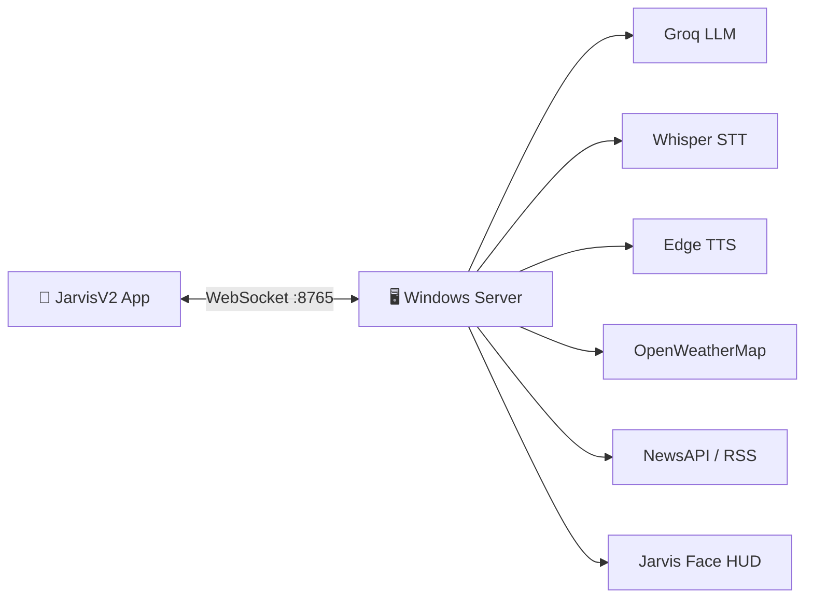

# Jarvis Windows Server

<p align="center">
  
  
  
  
</p>

<p align="center">
  <strong>Your personal AI assistant brain — runs on Windows, talks through your phone.</strong><br/>
  Voice recognition, natural speech, live chat, morning briefings, and PC control over WebSocket.
</p>

---

## What it does

| Feature | Description |
|--------|-------------|
| **AI Chat** | Powered by **Groq Llama 3.3 70B** with conversation memory & long-term facts |
| **Voice Mode** | Whisper speech-to-text + **Edge TTS** (British Ryan neural voice) |
| **Morning Briefing** | Real weather (OpenWeatherMap) + top news (NewsAPI with RSS fallback) |
| **Notifications** | AI summarizes phone notifications and speaks them aloud |
| **PC Control** | Launch apps, volume, shutdown/restart — from the mobile app |
| **Animated Face** | Optional pygame HUD that reacts while listening, thinking, and speaking |
| **ESP32 Ready** | Firmware included for sensor integration |

---

## Architecture



---

## Quick start

### 1. Clone & configure

```powershell
git clone https://github.com/vividh07/jarvis-windows-server.git
cd jarvis-windows-server
copy .env.example .env
```

Edit `.env` and add your API keys (see [Environment variables](#environment-variables)).

### 2. Install dependencies

```powershell
pip install python-dotenv websockets requests psutil numpy sounddevice openai-whisper edge-tts pygame pyttsx3 torch
```

> **Note:** First run downloads the Whisper `small` model (~500 MB).

### 3. Run the server

```powershell
python -u jarvis_windows_server.py
```

You should see:

```
Jarvis server listening on ws://0.0.0.0:8765
```

### 4. Connect the mobile app

Pair with [JarvisV2](https://github.com/vividh07/jarvis-v2) using your PC's local IP, e.g. `192.168.1.13:8765`.

---

## Environment variables

| Variable | Required | Description |
|----------|----------|-------------|
| `GROQ_API_KEY` | Yes | [Groq](https://console.groq.com) API key |
| `WEATHER_API_KEY` | For briefing | [OpenWeatherMap](https://openweathermap.org/api) key |
| `NEWS_API_KEY` | For briefing | [NewsAPI](https://newsapi.org) key (RSS fallback if unavailable) |
| `USER_NAME` | No | Your name — Jarvis uses it in conversation |
| `WEATHER_CITY` | No | Default: `Noida` |
| `AI_PROVIDER` | No | Default: `groq` |
| `GROQ_MODEL` | No | Default: `llama-3.3-70b-versatile` |
| `WEBSOCKET_PORT` | No | Default: `8765` |

Optional providers: `ANTHROPIC_API_KEY`, `GEMINI_API_KEY`

---

## Project structure

```
jarvis-windows-server/
├── jarvis_windows_server.py   # Main WebSocket server
├── jarvis_face.py             # Animated face overlay
├── jarvis_pc_daemon.py        # PC control helper
├── esp32_firmware/
│   └── sensors.ino            # ESP32 sensor sketch
├── .env.example               # Template for API keys
└── requirements.txt
```

---

## WebSocket message types

| Type | Direction | Purpose |
|------|-----------|---------|
| `chat` | App → Server | Send text message |
| `voice` | App → Server | Trigger voice capture on PC mic |
| `response` | Server → App | AI reply text |
| `mode` | Server → App | `listening` / `thinking` / `speaking` |
| `phone_notification` | App → Server | Forward notification for AI summary |
| `set_briefing_time` | App → Server | Schedule morning briefing |
| `clear_memory` | App → Server | Wipe conversation history |

---

## Related

- **Mobile app:** [github.com/vividh07/jarvis-v2](https://github.com/vividh07/jarvis-v2)

---

<p align="center">
  Built by <a href="https://github.com/vividh07">vividh07</a> · Jarvis, but yours.
</p>
